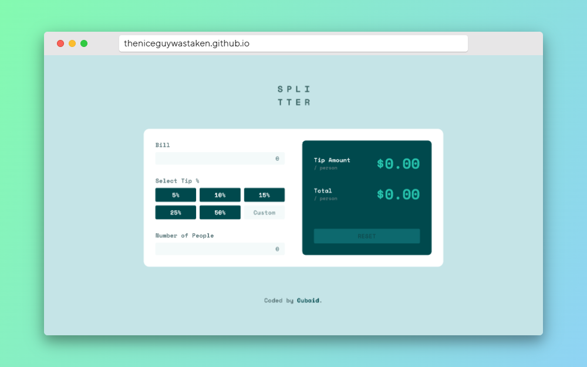
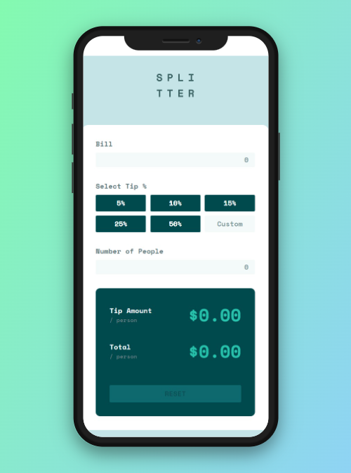

# Tip Calculator App Solution

This is my solution to the [Tip Calculator App challenge on Frontend Mentor](https://www.frontendmentor.io/challenges/tip-calculator-app-ugJNGbJUX). Frontend Mentor challenges are a great way to enhance your coding skills by working on real-world projects.

## Table of Contents

-   [Overview](#overview)
    -   [The Challenge](#the-challenge)
    -   [Screenshots](#screenshots)
    -   [Links](#links)
-   [My Process](#my-process)
    -   [Tech Stack](#tech-stack)
    -   [What I Learned](#what-i-learned)
    -   [Future Development](#future-development)
-   [Author](#author)

## Overview

### The Challenge

In this project, I created a Tip Calculator app that allows users to:

-   Easily view the app's layout on different devices
-   Interact with hover states for various elements on the page
-   Calculate the accurate tip and total bill per person

### Screenshots

### Links

-   [GitHub Repo](https://github.com/theniceguywastaken/tip-calculator-app-main)
-   [Live Site](https://theniceguywastaken.github.io/tip-calculator-app-main/)

## My Process

### Tech Stack

I built this project using the following technologies:

-   Semantic HTML5
-   Custom CSS properties
-   Flexbox and CSS Grid for layout
-   Followed a mobile-first workflow
-   JavaScript
-   Utilized [React](https://reactjs.org/) - a JavaScript library

### What I Learned

This was my first full-fledged React project, and it was an exciting journey. Despite my strong background in JavaScript, I enjoyed learning how React components interact and how to manage state between them. Working with React has been a great experience, and I plan to build more projects with it, insha'Allah.

### Future Development

In my ongoing development, I aim to focus on advanced state management and integrating Redux into my future projects. I'm also planning to create more full-stack applications using JavaScript, shifting from my previous experience with Python.

## Author

-   [LinkedIn - Oubaid](https://www.linkedin.com/in/oubaidelmoudhik/)
-   Frontend Mentor Profile - [@theniceguywastaken](https://www.frontendmentor.io/profile/theniceguywastaken)
-   Twitter - [@oubaidem](https://www.twitter.com/oubaidem)
-   UpWork - [@oubaidelmoudhik](https://www.upwork.com/freelancers/oubaidelmoudhik)

Feel free to explore the project and connect with me through these channels!
